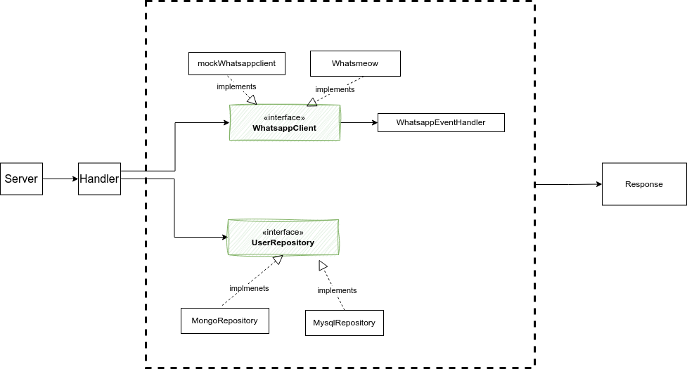
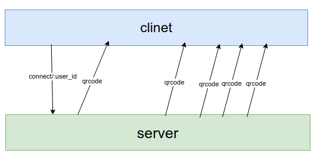

[](https://github.com/matinkhosravani/digi_express_challenge/actions/workflows/main.yml)

# Funtory Back-end Challenge

This repository contains an implementation of the Funtory back-end challenge.

## Usage
To use this project, follow these steps:

1. Clone the project repository.
2. Navigate to the cloned project folder.
3. Run the following command in the terminal:
   ```bash
   cp env.example
   docker-compose -f docker-compose-dev.yml up -d --build 
   ```
   server will start listening on **localhost:3000**.

Note: be sure to change proxy_enable variable in the env file

## Tests
### Running all tests
To run all tests, use the following command:
```bash
docker-compose exec go go test ./...
```

## API Documentation
Access the API documentation by visiting the following URL in your web browser:
```
localhost:8888/swagger/index.html
```

## Structure
The project is simillar to Uncle Bob's clean architecture principles and consists of three layers:

1. Models Layer (not mentioned in the diagram)
2. Repository Layer



All layers are designed to be interchangeable. For example, you can easily replace the `postgresRepository` with `MongoRepository`, which implements the User Repository. Additionally, in tests, you can use a mock usecase for better testability.
Note: I didn't add a usecase layer because I think it's an overkill for this task.
Note: The Delivery layer has not been abstracted for the sake of simplicity.

## Approach
This project implements the following approach for integrating WhatsApp with a user database using server-side events:

**When a user sends a request:**
If the user already has an account attached, no QR code is generated.
If the user has no account attached, QR codes are sent to the client using server-side events.

**Handling QR code expiration:**
Whenever a QR code expires, a new QR code is automatically pushed to the client to ensure continuous functionality.

**Limiting QR code sending:**
If the system exceeds the limit of sending QR codes, the connection will be closed to prevent overload.

**Timeout handling:**
In the event of a timeout, the connection will be closed to manage server resources efficiently.



## TODOs
* Add more test
* Abstract Client store
* Cover more scenario and errors
* Integrate error and responses
